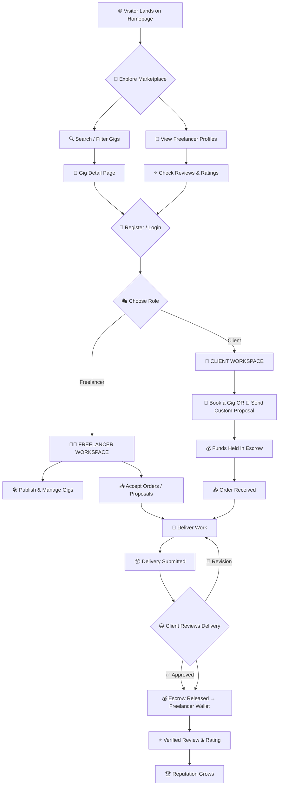
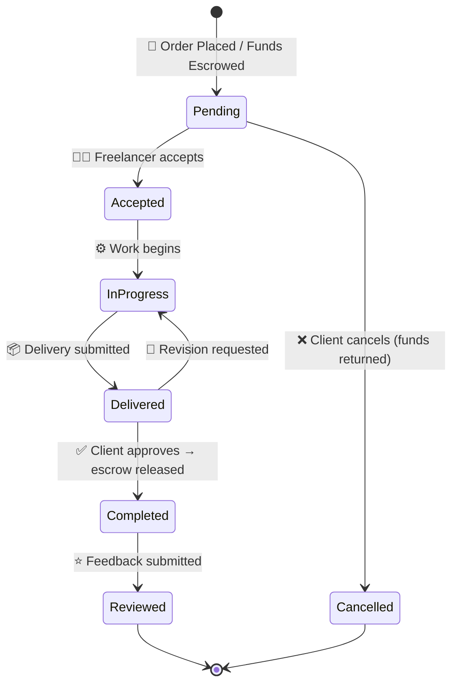
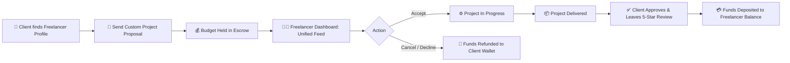
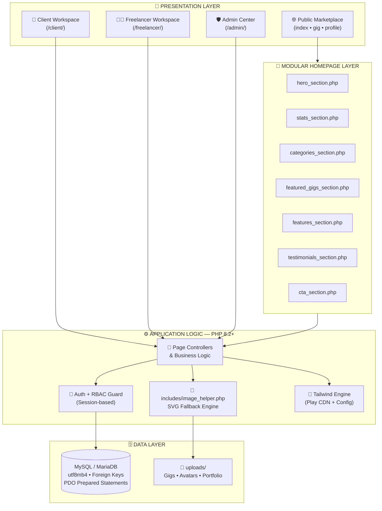
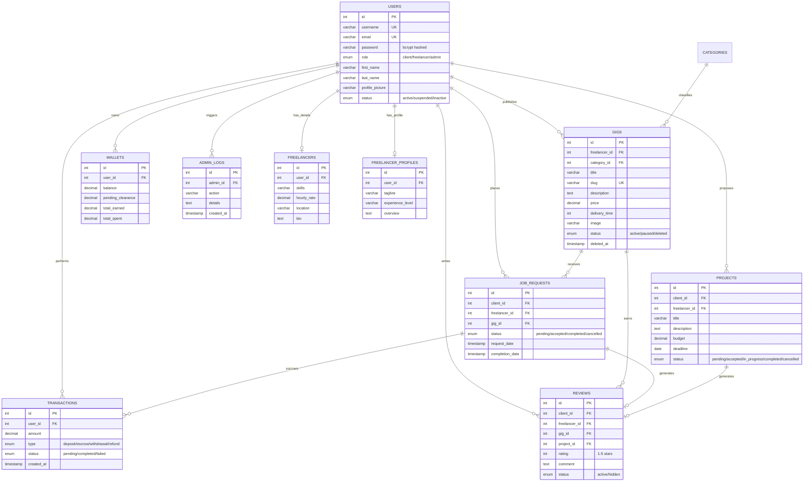
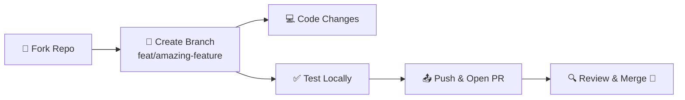

<div align="center">

<br/>


# ⚡ FreelanceHub PRO

### 🌐 Next-Generation Freelance Marketplace & Services Platform

<br/>

> ### 💬 *"Where World-Class Talent Meets Ambitious Projects"*
> Connecting visionary clients with elite digital professionals — seamlessly, securely, and beautifully.

<br/>

<!-- ════════════════════ BADGE WALL ════════════════════ -->

[](https://www.php.net/)
[](https://tailwindcss.com/)
[](https://www.mysql.com/)
[](LICENSE)
[](#changelog)

[](#acknowledgments)
[](#design)
[](https://michalsnik.github.io/aos/)
[](#contributing)

[](https://github.com/Dilan-Sathruwan/Freelancer-Website)
[](https://github.com/Dilan-Sathruwan/Freelancer-Website)
[](https://github.com/Dilan-Sathruwan/Freelancer-Website)
[](https://github.com/Dilan-Sathruwan/Freelancer-Website)
[](https://github.com/Dilan-Sathruwan/Freelancer-Website/issues)

<br/>

<!-- ════════════════════ QUICK NAVIGATION ════════════════════ -->

[🌟 Features](#features) • [🖼️ Screenshots](#screenshots) • [🚀 Quick Start](#installation) • [🔑 Demo](#demo) • [🗄️ Database](#database) • [🎨 Design](#design) • [🗺️ Roadmap](#roadmap) • [❓ FAQ](#faq)

<br/>

---

</div>

<a id="top"></a>

## 📜 Table of Contents

| # | Section | # | Section |
|:-:|:---|:-:|:---|
| 01 | [💡 About the Project](#about) | 12 | [🗄️ Database Architecture](#database) |
| 02 | [✨ Feature Matrix](#features) | 13 | [📁 Project Structure](#structure) |
| 03 | [🖼️ UI Gallery](#screenshots) | 14 | [🔗 Route Map](#routes) |
| 04 | [🗺️ User Journey](#journey) | 15 | [🔐 Security Fortress](#security) |
| 05 | [🏛️ System Architecture](#architecture) | 16 | [🚄 Performance](#performance) |
| 06 | [🌟 Core Highlights](#highlights) | 17 | [🌐 Browser Compatibility](#browser) |
| 07 | [🚀 Key Modules & Workspaces](#modules) | 18 | [🗺️ Roadmap](#roadmap) |
| 08 | [🎨 Design System](#design) | 19 | [📈 Changelog](#changelog) |
| 09 | [💻 Tech Stack](#techstack) | 20 | [❓ FAQ](#faq) |
| 10 | [🧩 Code Quality Snippets](#codesnippets) | 21 | [🤝 Contributing](#contributing) |
| 11 | [⚡ Quick Start](#installation) | 22 | [⭐ Support & Acknowledgments](#acknowledgments) |

<br/>

---

## 💡 About the Project

<a id="about"></a>

> [!NOTE]
> **FreelanceHub PRO** is a modern, enterprise-grade freelance marketplace web application built with **PHP (PDO)**, **MySQL / MariaDB**, and **100% Pure Tailwind CSS**. It seamlessly connects clients seeking specialized digital services with world-class freelancers offering custom gigs and bespoke project delivery.

Whether you're a **client** hunting for the perfect creative talent, a **freelancer** building your digital empire, or an **administrator** governing an entire marketplace ecosystem — FreelanceHub PRO delivers a polished, secure, and lightning-fast experience for everyone.

<br/>

### 📊 Project Pulse

| Metric | Status | Metric | Status |
|:---|:---|:---|:---|
| 🧩 **Core Modules** | `4 Major Workspaces` | 📄 **PHP Pages & Partials** | `45+ Views & Components` |
| 🗄️ **Database Tables** | `11+ Relational Tables` | 🎨 **Styling** | `100% Pure Tailwind CSS (Zero Custom CSS)` |
| 🔐 **User Roles** | `3 Isolated Roles (Freelancer/Client/Admin)` | 🌓 **Themes** | `Dark + Light (Persistent Zero-FOUC)` |
| 🛡️ **Security Layers** | `7+ Defense Systems` | 📱 **Responsiveness** | `100% Mobile-First Adaptive` |

<br/>

> [!TIP]
> ⚡ **New here?** Jump straight to the [Quick Start Guide](#installation) and get the platform running in under 5 minutes!

<br/>

---

## ✨ Feature Matrix

<a id="features"></a>

### 🌐 Public Marketplace

| Feature | Description | Status |
|:---|:---|:---:|
| 🔍 **Smart Search** | Live keyword search across the entire gig catalog with instant keyword filtering | ✅ |
| 🗂️ **Category Filtering** | Browse services by specialized sectors (Development, Design, Writing, Marketing, etc.) | ✅ |
| 💰 **Price & Rating Sorting** | Sort by budget tier (lowest/highest first) or customer review score | ✅ |
| 📄 **Instant Pagination** | Smooth page navigation with preserved query parameters across search & categories | ✅ |
| 🧩 **Modular Components** | Divided homepage architecture into reusable, maintainable component partials | ✅ |
| 🎠 **Interactive Testimonials Slider** | Touch/swipe & keyboard-enabled modern slider with avatar pills & gold rating badges | ✅ |
| 🦶 **World-Class Modern Footer** | Multi-column layout with animated newsletter subscription, social badges, and live system status | ✅ |
| 🖼️ **SVG Fallback Engine** | Dynamic vector placeholder engine — zero broken images or avatars anywhere | ✅ |
| ⚡ **SEO-Friendly URLs** | Clean, descriptive query structures and automatic slug resolution for services | ✅ |

### 👨‍💻 Freelancer Workspace

| Feature | Description | Status |
|:---|:---|:---:|
| 📊 **Live Dashboard** | Real-time overview of wallet earnings, active gigs count, completed orders, and star rating | ✅ |
| 🛠️ **Gig CRUD Studio** | Create, view, edit via modal dialog, and archive gigs with safe soft-delete fallback | ✅ |
| 🖼️ **Live Image Preview** | Real-time client-side preview for gig cover upload with clear control button | ✅ |
| 👁️ **1-Click Visibility Toggle** | Instant active/paused listing control to temporarily pause services from public view | ✅ |
| 📥 **Unified Incoming Feed** | Combined tracking of marketplace gig bookings (`job_requests`) AND custom direct contracts (`projects`) | ✅ |
| ⭐ **Reputation Center** | Client star ratings, detailed comments, and social proof testimonial showcase | ✅ |
| 👤 **Profile Quick-Edit** | Update first name, last name, and phone number directly from the dashboard | ✅ |
| 🛡️ **Soft-Delete Safety** | Gigs marked as deleted preserve relationships with existing client orders via `deleted_at` | ✅ |

### 🏢 Client Workspace

| Feature | Description | Status |
|:---|:---|:---:|
| 💼 **Escrow Metrics Hub** | Real-time available funds, active hires count, completed jobs, and lifetime investment | ✅ |
| 🗂️ **Tabbed Order Tracking** | Clean switcher for marketplace gig bookings vs bespoke 1-on-1 project proposals | ✅ |
| 🚫 **Safe 1-Click Cancellation** | Status-safeguarded cancellation for pending orders (`?cancelRequest=ID`) & proposals (`?cancelProject=ID`) | ✅ |
| 🤝 **Direct Hiring** | Custom proposals defining specific deliverables, milestone deadlines, and budget amounts | ✅ |
| ⭐ **Verified Review Engine** | Multi-criteria 5-star rating submission upon order completion with review verification | ✅ |
| 🖼️ **Visual Hires Table** | Interactive cards with gig cover thumbnails, seller avatars, price badges, and status pills | ✅ |

### 🛡️ Admin Command Center

| Feature | Description | Status |
|:---|:---|:---:|
| 📈 **Platform Analytics** | Total users, transactions, active gigs, and platform revenue KPIs at a glance | ✅ |
| 👥 **8+ Management Consoles** | Users, freelancers, clients, admins, gigs, orders, categories, finance, and reviews | ✅ |
| 🧾 **Audit & Activity Logs** | Timestamped operation tracking for administrative governance (`admin_activity.php`) | ✅ |
| 💳 **Transaction Oversight** | Complete escrow, payment, deposit, and financial audit trail | ✅ |
| 🎯 **Role-Based Access Control** | Strictly isolated administrative privileges and security enforcement | ✅ |

<br/>

---

## 🖼️ UI Gallery

<a id="screenshots"></a>

> 📸 *Place your screenshots in `assets/screenshots/` — the sections below are ready for you!*

<table>
  <tr>
    <td width="50%" align="center">
      
      <br/><sub><b>🏠 Modern Landing Page</b><br/>Hero + Live Search + Modular Components + Interactive Slider</sub>
    </td>
    <td width="50%" align="center">
      
      <br/><sub><b>🛒 Service Marketplace</b><br/>Filtering • Sorting • Pagination • SVG Fallbacks</sub>
    </td>
  </tr>
  <tr>
    <td width="50%" align="center">
      
      <br/><sub><b>👨‍💻 Freelancer Dashboard</b><br/>Modal CRUD + Status Toggle + Unified Feed + Reviews</sub>
    </td>
    <td width="50%" align="center">
      
      <br/><sub><b>🏢 Client Hub</b><br/>Escrow Wallet + Tabbed Orders + Safe 1-Click Cancellation</sub>
    </td>
  </tr>
  <tr>
    <td width="50%" align="center">
      
      <br/><sub><b>🛡️ Admin Command Center</b><br/>Platform Analytics + 8+ Governance Consoles + Activity Logs</sub>
    </td>
    <td width="50%" align="center">
      
      <br/><sub><b>🌙 One-Tap Dark Mode</b><br/>Zero-FOUC Theme Switching + localStorage Sync</sub>
    </td>
  </tr>
</table>

<br/>

---

## 🗺️ User Journey & Platform Flow

<a id="journey"></a>

### 👤 The Complete User Lifecycle



### 📦 Order Lifecycle — Escrow Protected



### 🤝 Direct Contract & Custom Proposal Flow



<br/>

---

## 🏛️ System Architecture

<a id="architecture"></a>



<br/>

> [!IMPORTANT]
> Every request passes through the **RBAC Guard**, ensuring freelancers, clients, and admins can only ever reach their authorized workspaces. Role isolation is enforced at the session level.

<br/>

---

## 🌟 Core Highlights

<a id="highlights"></a>

<table>
<tr><td>

<br/>

🎨 **100% Pure Tailwind CSS Design**
> Complete elimination of legacy custom CSS files in favor of unified Tailwind utility tokens, smooth transitions, and glassmorphic blur effects.

<br/>

</td><td>

<br/>

🌓 **Instant Dark / Light Mode**
> Dynamic theme switcher with zero flash of unstyled content (FOUC), synced to browser preferences and persisted in `localStorage` under `freelancehub_theme`.

<br/>

</td></tr>

<tr><td>

<br/>

🔐 **Robust Role-Based Access Control**
> Distinct, fully-isolated workspaces for **Freelancers**, **Clients**, and **Platform Administrators** — no cross-contamination possible.

<br/>

</td><td>

<br/>

💼 **Gigs + Direct Contracts**
> Dual revenue paths: fixed-price marketplace listings *and* bespoke 1-on-1 custom project proposals.

<br/>

</td></tr>

<tr><td>

<br/>

🛡️ **Escrow Wallet System**
> Real-time tracking of available balances, pending escrow clearance, and lifetime platform investments.

<br/>

</td><td>

<br/>

⭐ **Verified Social Proof Engine**
> 5-star reviews across 4 criteria: communication, service quality, on-time delivery, value for money.

<br/>

</td></tr>

<tr><td>

<br/>

🖼️ **Dynamic Image Helper & Fallbacks**
> Smart vector SVG avatar + gig placeholder generator ensuring **zero broken image links** across the entire platform.

<br/>

</td><td>

<br/>

🧩 **Modular Component Architecture**
> Homepage cleanly decomposed into lightweight, isolated component partials (`components/`) for maximum maintainability.

<br/>

</td></tr>
</table>

<br/>

---

## 🚀 Key Modules & Workspaces

<a id="modules"></a>

### 👨‍💻 1. Freelancer Workspace — `/freelancer/`

<details open>
<summary><b>📎 Expand Full Module Details</b></summary>

<br/>

| Sub-Module | Capabilities |
|:---|:---|
| 📊 **Control Dashboard** | Real-time overview of wallet earnings, active gigs count, completed orders, and platform star rating |
| 🛠️ **Gig Management** | Full CRUD with pre-populated modal editor, live cover image preview, and 1-click active/paused visibility toggle |
| 👁️ **1-Click Visibility Toggle** | Instant active/paused listing control to temporarily pause services without deleting |
| 📥 **Unified Incoming Feed** | Combined widget tracking marketplace orders (`job_requests`) and direct contracts (`projects`) |
| ⭐ **Reputation Center** | Recent client feedback and star testimonial showcase with verified comments and avatars |
| 📈 **Earnings Tracker** | Lifetime income, pending escrow clearance, and withdrawal readiness |
| 👤 **Profile Quick-Edit** | Instant inline updates for first name, last name, and phone contact details |
| 🛡️ **Soft-Delete Safety** | Safe gig archiving preserving transaction and review integrity with `deleted_at` |

</details>

<br/>

### 🏢 2. Client Workspace — `/client/`

<details open>
<summary><b>📎 Expand Full Module Details</b></summary>

<br/>

| Sub-Module | Capabilities |
|:---|:---|
| 💼 **Hub Dashboard** | Escrow funds, active hires, completed projects, total platform expenditure |
| 🗂️ **Order Management** | Tabbed tracking for marketplace gig bookings and custom proposals |
| 🚫 **Safe 1-Click Cancellation** | Status-safeguarded cancellation for pending gig requests (`?cancelRequest=ID`) and proposals (`?cancelProject=ID`) |
| 🤝 **Direct Hiring** | Custom proposals defining deliverables, timeline, budget, and escrow allocation |
| ⭐ **Review Engine** | Multi-metric verified ratings and feedback for delivered jobs |
| 🖼️ **Visual Hires Cards** | Service covers with fallback helper, freelancer avatars, price tags, and real-time status badges |

</details>

<br/>

### 🛡️ 3. Admin Command Center — `/admin/`

<details open>
<summary><b>📎 Expand Full Module Details</b></summary>

<br/>

| Sub-Module | Capabilities |
|:---|:---|
| 📈 **System Overview** | Platform analytics: users, transactions, active gigs, platform revenue |
| 👥 **User Management** | Dedicated consoles for users, freelancers, clients, and administrators |
| 🛒 **Marketplace Oversight** | Gigs, orders, and categories moderation |
| 💳 **Finance Console** | Escrow and transaction audit trails |
| 🧾 **Audit & Activity Logs** | Timestamped platform operation tracking (`admin_activity.php`) |

</details>

<br/>

### 🌐 4. Public Marketplace — `/` & `/public/`

<details open>
<summary><b>📎 Expand Full Module Details</b></summary>

<br/>

| Page | Capabilities |
|:---|:---|
| 🏠 **Landing Page (`index.php`)** | Hero banner with live search, live metrics, categories, featured gigs, features/how-it-works, testimonials slider, CTA, and footer |
| 🛒 **Service Directory (`public/gig.php`)** | Dynamic category filters, keyword search, price sorting, instant pagination |
| 📄 **Gig Detail Page (`public/gig_detail.php`)** | Full overview, pricing packages, seller card, reviews, direct booking CTA |
| 👤 **Public Profile (`public/profile.php`)** | Portfolio showcase, bio, verified badges, hourly rate, active listings |
| 🤝 **Hire Gig Action (`public/hire_gig.php`)** | Quick booking workflow connecting client intent to direct gig fulfillment |

</details>

<br/>

### 🧩 5. Modular Homepage Components — `/components/`

<details open>
<summary><b>📎 Expand Component Details</b></summary>

<br/>

| Component File | Role & Visual Presentation |
|:---|:---|
| `components/hero_section.php` | Dynamic hero with floating gradient badges, live search form, and instant stats |
| `components/stats_section.php` | Live platform metrics counter (active freelancers, completed projects, customer satisfaction) |
| `components/categories_section.php` | Dynamic service category cards with real-time gig counts fetched from database |
| `components/featured_gigs_section.php` | Curated marketplace services grid featuring price badges, delivery time, and seller avatars |
| `components/features_section.php` | Dual-sided value proposition detailing the 3-step workflow for both clients and freelancers |
| `components/testimonials_section.php` | Modern interactive slider with autoplay, touch/swipe navigation, avatar pills, and gold rating stars |
| `components/cta_section.php` | High-conversion registration call-to-action with animated gradient background |

</details>

<br/>

### 🔐 6. Authentication System — `/auth/`

<details open>
<summary><b>📎 Expand Authentication Details</b></summary>

<br/>

| File | Description |
|:---|:---|
| `auth/login.php` | Responsive authentication portal with 1-click speed demo buttons for Admin, Freelancer, and Client |
| `auth/signup.php` | Role-based registration enabling client or freelancer account creation with validation |
| `auth/logout.php` | Clean session destruction, cache clearing, and secure redirection to landing page |
| `auth/reset_password.php` | Password recovery workflow with token validation |

</details>

<br/>

### 🧰 7. Shared Core Includes — `/includes/`

<details open>
<summary><b>📎 Expand Includes Details</b></summary>

<br/>

| File | Description |
|:---|:---|
| `includes/index_header.php` | Floating dock navigation bar with dark mode toggle and role-based action buttons |
| `includes/header.php` | Unified header wrapper for internal pages |
| `includes/footer.php` | World-class modern footer with animated newsletter, status beacon, social links, and back-to-top |
| `includes/admin_header.php` | Specialized administrative navigation header |
| `includes/admin_footer.php` | Administrative footer partial |
| `includes/image_helper.php` | Dynamic vector SVG avatar & gig placeholder engine ensuring zero broken images |
| `includes/logging_functions.php` | Centralized audit log tracking helper for administrative record-keeping |

</details>

<br/>

---

## 🎨 Design System

<a id="design"></a>

### 🌈 Color Palette

| Swatch | Token | Hex | Usage | Dark Mode |
|:---:|:---|:---|:---|:---|
| 🔵 | `primary` | `#6366F1` | Brand identity, primary CTAs, active states | `indigo-500` |
| 🟣 | `secondary` | `#8B5CF6` | Gradients, hover highlights, badges | `purple-500` |
| 💖 | `accent` | `#EC4899` | Glow effects, hot tags, accents | `pink-500` |
| 🟢 | `success` | `#10B981` | Confirmations, earnings, active badges | `emerald-500` |
| 🟡 | `warning` | `#F59E0B` | Pending states, star ratings, paused | `amber-500` |
| 🔴 | `danger` | `#F43F5E` | Destructive actions, cancellations | `rose-500` |
| ⚫ | `surface` | `#0F172A` | Dark theme backgrounds (`slate-950`) | 🌙 |
| ⚪ | `light` | `#F8FAFC` | Light theme backgrounds (`slate-50`) | ☀️ |

### ✍️ Typography

| Element | Font | Weight | Purpose |
|:---|:---|:---:|:---|
| Headings | `Inter` | `700 – 900` | Bold, commanding page titles and metric numbers |
| Body | `Inter` | `400 – 500` | Clean, highly-legible content and descriptions |
| Captions | `Inter` | `300 – 400` | Subtle metadata, timestamps & category labels |

### 🪟 UI Effects Library

```yaml
Glassmorphism:     backdrop-blur-xl + semi-transparent bg-white/95 dark:bg-slate-900/95
Micro-interaction: scale-105 + active:scale-95 smooth transforms on buttons
Scroll Reveal:     AOS fade-up, duration-600, once: true for graceful viewport entry
Theme Transition:  300ms smooth color interpolation across all HTML elements
Focus States:      Accessible ring-2 ring-purple-500/20 focus indicators
Shadows:           Layered soft shadows (shadow-sm → shadow-2xl elevation scale)
```

### ⚓ Streamlined Dock Navigation
The top navigation header (`includes/index_header.php`) is designed as a distraction-free, floating dock. In response to design refinement, notification bell icons were removed to deliver a minimalist, modern aesthetic focused purely on search, service discovery, role-based quick links, and one-tap dark/light mode toggling.

### 🦶 World-Class Modern Footer
The global footer (`includes/footer.php`) delivers a unique, state-of-the-art layout featuring:
- Animated brand badge with glassmorphism and subtle gradient glow.
- Dynamic newsletter subscription box with interactive feedback.
- Real-time operational platform status beacon ("All systems normal").
- Categorized quick links, service sectors, and legal documentation.
- Smooth floating back-to-top button with interactive scroll listener.

### 🎠 Interactive Testimonials Slider
The testimonials section (`components/testimonials_section.php` & `assets/js/slider.js`) features a responsive, clean carousel with:
- Gold star ratings and verified client badges.
- Avatar pills with fallback SVG integration.
- Smooth transition animations with autoplay and pause-on-hover.
- Full keyboard (Arrow Left / Right) and mobile touch/swipe gesture support.

<br/>

---

## 💻 Tech Stack & Architecture

<a id="techstack"></a>

| Layer | Technology | Purpose | Grade |
|:---|:---|:---|:---:|
| **Backend** |  | OOP PDO abstraction, bcrypt hashing, sessions | 🏆 |
| **Database** |  | Relational schema, FK constraints, `utf8mb4` | 🏆 |
| **Styling** |  | Pure utility classes, custom palette, dark mode | 🏆 |
| **Typography** |  | Modern sans-serif across all viewports | 🥇 |
| **Icons** |  | Lightweight vector icon set (`ri-*`) | 🥇 |
| **Animation** |  | Scroll-triggered micro-interactions | 🥇 |
| **Media** | 🔧 Custom Helper | SVG fallback engine in `image_helper.php` | 🥇 |

<br/>

---

## 🧩 Under the Hood — Code Samples

<a id="codesnippets"></a>

<details>
<summary>🔐 <b>Ultra-Secure PDO Connection</b> — <i>config/db.con.php</i></summary>

```php
<?php
define('DB_HOST', 'localhost');
define('DB_PORT', '3306');
define('DB_USER', 'root');
define('DB_PASS', '');
define('DB_NAME', 'freelancerwebsite');
define('DB_CHARSET', 'utf8mb4');

try {
    $dsn = "mysql:host=" . DB_HOST . ";port=" . DB_PORT . ";dbname=" . DB_NAME . ";charset=" . DB_CHARSET;
    $conn = new PDO($dsn, DB_USER, DB_PASS, [
        PDO::ATTR_ERRMODE            => PDO::ERRMODE_EXCEPTION,
        PDO::ATTR_DEFAULT_FETCH_MODE => PDO::FETCH_ASSOC,
        PDO::ATTR_EMULATE_PREPARES   => false, // Critical for preventing SQL injection
        PDO::ATTR_PERSISTENT         => false,
        PDO::ATTR_TIMEOUT            => 5,
    ]);
} catch (PDOException $e) {
    error_log("Database connection failed: " . $e->getMessage());
    die("Database connection failed. Please check platform configuration.");
}
```
</details>

<details>
<summary>🛡️ <b>SQL-Injection-Proof Query Pattern with Input Sanitization</b></summary>

```php
// ✅ SAFE — Parameterized query with strict type casting & sanitization
$freelancerId = filter_var($_SESSION['user_id'], FILTER_VALIDATE_INT);
$status = 'active';

$stmt = $conn->prepare("
    SELECT g.*, c.name AS category_name 
    FROM gigs g 
    LEFT JOIN categories c ON g.category_id = c.id 
    WHERE g.freelancer_id = ? AND g.status = ?
    ORDER BY g.created_at DESC
");
$stmt->execute([$freelancerId, $status]);
$activeGigs = $stmt->fetchAll();

// ❌ NEVER do this — vulnerable to SQL injection:
// $conn->query("SELECT * FROM gigs WHERE id = " . $_GET['id']);
```
</details>

<details>
<summary>🖼️ <b>Smart SVG Image Fallback Engine</b> — <i>includes/image_helper.php</i></summary>

```php
// Guarantees zero broken images across all client and freelancer views
function resolveAvatarUrl(?string $dbPath, string $rootPath = './', string $name = 'User'): string {
    if (!empty($dbPath)) {
        $cleanPath = ltrim($dbPath, '/');
        if (file_exists(dirname(__DIR__) . '/' . $cleanPath)) {
            return $rootPath . $cleanPath;
        }
    }
    // Return high-quality localized SVG fallback avatar
    return $rootPath . 'assets/img/placeholder-avatar.svg';
}

function resolveGigImage(?string $dbPath, string $rootPath = './'): string {
    if (!empty($dbPath)) {
        $cleanPath = ltrim($dbPath, '/');
        if (file_exists(dirname(__DIR__) . '/' . $cleanPath)) {
            return $rootPath . $cleanPath;
        }
    }
    // Return high-quality localized SVG fallback gig cover
    return $rootPath . 'assets/img/placeholder-gig.svg';
}
```
</details>

<details>
<summary>🌓 <b>Zero-FOUC Theme Switcher</b> — <i>Inline in &lt;head&gt;</i></summary>

```html
<script>
  // Runs synchronously before paint — eliminates dark mode flash entirely
  (function () {
    try {
      var savedTheme = localStorage.getItem('freelancehub_theme');
      var systemDark = window.matchMedia('(prefers-color-scheme: dark)').matches;
      if (savedTheme === 'dark' || (!savedTheme && systemDark)) {
        document.documentElement.classList.add('dark');
      } else {
        document.documentElement.classList.remove('dark');
      }
    } catch (e) {}
  })();
</script>
```
</details>

<details>
<summary>🛠️ <b>Freelancer Gig Modal Update & 1-Click Visibility Toggle</b> — <i>freelancer/dashboard.php</i></summary>

```php
// 1-Click Status Visibility Toggle
if (isset($_GET['toggleStatus'])) {
    $toggleGigId = intval($_GET['toggleStatus']);
    $stmtFind = $conn->prepare("SELECT status FROM gigs WHERE id = ? AND freelancer_id = ?");
    $stmtFind->execute([$toggleGigId, $freelancerId]);
    $currentStatus = $stmtFind->fetchColumn();

    if ($currentStatus) {
        $newStatus = ($currentStatus === 'active') ? 'paused' : 'active';
        $stmtUp = $conn->prepare("UPDATE gigs SET status = ? WHERE id = ? AND freelancer_id = ?");
        $stmtUp->execute([$newStatus, $toggleGigId, $freelancerId]);
    }
    header("Location: dashboard.php?msg=status_updated");
    exit;
}

// Modal Gig Update Handler
if ($_SERVER['REQUEST_METHOD'] === 'POST' && isset($_POST['action']) && $_POST['action'] === 'updateGig') {
    $editGigId = intval($_POST['gig_id']);
    $editTitle = trim($_POST['title']);
    $editCategory = intval($_POST['category_id']);
    $editPrice = floatval($_POST['price']);
    $editDelivery = intval($_POST['delivery_time']);
    $editDesc = trim($_POST['description']);
    $editStatus = in_array($_POST['status'], ['active', 'paused']) ? $_POST['status'] : 'active';

    // Image upload handling with safe fallback
    $stmtUpdate = $conn->prepare("
        UPDATE gigs 
        SET title = ?, category_id = ?, price = ?, delivery_time = ?, description = ?, status = ?
        WHERE id = ? AND freelancer_id = ?
    ");
    $stmtUpdate->execute([$editTitle, $editCategory, $editPrice, $editDelivery, $editDesc, $editStatus, $editGigId, $freelancerId]);
    header("Location: dashboard.php?msg=gig_updated");
    exit;
}
```
</details>

<details>
<summary>🚫 <b>Client Safe Pending Cancellation Handler</b> — <i>client/dashboard.php</i></summary>

```php
// Safe Cancellation for Pending Gig Job Requests
if (isset($_GET['cancelRequest'])) {
    $reqId = intval($_GET['cancelRequest']);
    $stmtCheck = $conn->prepare("SELECT id FROM job_requests WHERE id = ? AND client_id = ? AND status = 'pending'");
    $stmtCheck->execute([$reqId, $clientId]);
    if ($stmtCheck->fetch()) {
        $stmtCancel = $conn->prepare("UPDATE job_requests SET status = 'cancelled' WHERE id = ?");
        $stmtCancel->execute([$reqId]);
        header("Location: dashboard.php?cancelled=1");
        exit;
    }
}

// Safe Cancellation for Pending Direct Proposals
if (isset($_GET['cancelProject'])) {
    $projId = intval($_GET['cancelProject']);
    $stmtCheckP = $conn->prepare("SELECT id FROM projects WHERE id = ? AND client_id = ? AND status = 'pending'");
    $stmtCheckP->execute([$projId, $clientId]);
    if ($stmtCheckP->fetch()) {
        $stmtCancelP = $conn->prepare("UPDATE projects SET status = 'cancelled' WHERE id = ?");
        $stmtCancelP->execute([$projId]);
        header("Location: dashboard.php?cancelled=1");
        exit;
    }
}
```
</details>

<br/>

---

## ⚡ Quick Start & Installation

<a id="installation"></a>

### ✅ Prerequisites

| Requirement | Version | Download |
|:---|:---:|:---|
| 🖥️ Local Server | XAMPP / WAMP / Laragon | [Apachefriends](https://www.apachefriends.org/) |
| 🐘 PHP | `8.2+` (with PDO MySQL) | [php.net](https://www.php.net/) |
| 🗄️ MySQL / MariaDB | `8.0+ / 10.6+` | [mysql.com](https://www.mysql.com/) |
| 🌐 Apache Web Server | Port `80` (or configured vhost) | Included in server stack |

### 🪜 5-Minute Setup

```
┌──────────────────────────────────────────────────────────┐
│  STEP 1 ──▶ 📂 Place project in server root (htdocs)     │
│  STEP 2 ──▶ ⚙️  Configure database credentials           │
│  STEP 3 ──▶ 🗄️  Import schema + seed data (sql/)         │
│  STEP 4 ──▶ 🚀 Start Apache & MySQL in XAMPP             │
│  STEP 5 ──▶ 🎉 Open http://localhost/Freelancer-Website/ │
└──────────────────────────────────────────────────────────┘
```

**1️⃣ Clone or Move the Repository**

```bash
# For XAMPP on Windows:
cd C:/xampp/htdocs/
git clone https://github.com/Dilan-Sathruwan/Freelancer-Website.git
```

**2️⃣ Configure Database Credentials**

Verify or adjust settings in [`config/db.con.php`](config/db.con.php):

```php
define('DB_HOST', 'localhost');
define('DB_PORT', '3306');
define('DB_USER', 'root');
define('DB_PASS', '');
define('DB_NAME', 'freelancerwebsite');
```

**3️⃣ Import Database Schema & Sample Data**

Open **phpMyAdmin** (`http://localhost/phpmyadmin/`) or MySQL CLI:

```sql
-- 1. Create the database
CREATE DATABASE freelancerwebsite 
  CHARACTER SET utf8mb4 
  COLLATE utf8mb4_unicode_ci;

-- 2. Import in sequential order:
-- 📄 sql/SQL v3.txt      → Complete DDL table schemas & constraints
-- 🌱 sql/Dummy_Data.txt  → Pre-seeded demo accounts (all passwords: 123)
```

**4️⃣ Launch the Application**

```
🌐 http://localhost/Freelancer-Website/
```

> [!SUCCESS]
> 🎉 **That's it!** Log in with any demo account below and start exploring.

<br/>

---

## 🔑 Demo Credentials

<a id="demo"></a>

> [!WARNING]
> All demo accounts use the standardized password **`123`** (hashed with bcrypt). **Never** deploy with these credentials in production!

| Role | Username | Password | Dashboard URL | Capabilities |
|:---|:---|:---:|:---|:---|
| 🛡️ **Administrator** | `admin` | `123` | `/admin/dashboard.php` | Full platform governance, logs, orders & users |
| 👨‍💻 **Freelancer** | `user1` | `123` | `/freelancer/dashboard.php` | Senior Full-Stack Developer: CRUD, orders widget, reviews, earnings |
| 👨‍💻 **Freelancer** | `user2` | `123` | `/freelancer/dashboard.php` | UI/UX Designer: Active gig catalog & project contracts |
| 👨‍💻 **Freelancer** | `user3` | `123` | `/freelancer/dashboard.php` | Content & SEO Specialist: Live reviews & proposals |
| 🏢 **Client** | `client1` | `123` | `/client/dashboard.php` | Tech Ventures: Marketplace ordering, proposals, reviews |
| 🏢 **Client** | `client2` | `123` | `/client/dashboard.php` | Apex Media: Direct hiring & escrow management |
| 🏢 **Client** | `client3` | `123` | `/client/dashboard.php` | NextGen Startup: Order cancellation & milestones |

<br/>

<div align="center">

**⚡ Speed Login** — The login page (`/auth/login.php`) includes **1-click demo buttons** for instant role-switching!
<br/>
*Local developers can also inspect active credentials at `/setup/dev_credentials.php`.*

</div>

<br/>

---

## 🗄️ Database Architecture

<a id="database"></a>

### 🧬 Entity Relationship Diagram



### 📋 Table Inventory

| Table | Records Purpose | Key Relations |
|:---|:---|:---|
| `users` | Core authentication, personal details & role mapping | Hub of all platform entities |
| `categories` | Service taxonomy & sectors (Development, Design, etc.) | → `gigs` |
| `gigs` | Freelancer service listings with pricing, delivery & soft deletes | → `users`, `categories` |
| `job_requests` | Marketplace gig bookings with escrow status | → `users`, `gigs` |
| `projects` | Bespoke 1-on-1 client proposals and custom contracts | → `users` |
| `reviews` | Verified client feedback, ratings & testimonials | → `users`, `gigs`, `projects` |
| `wallets` | Balance, pending escrow clearance, lifetime earnings | → `users` |
| `transactions` | Complete platform financial transaction history | → `users` |
| `freelancers` | Skills, hourly rates, location & bio | → `users` |
| `freelancer_profiles`| Taglines, experience levels, portfolio links | → `users` |
| `admin_logs` | Administrative moderation audit trail | → `users` |

<br/>

---

## 📁 Project Structure

<a id="structure"></a>

```
Freelancer-Website/
│
├── 📁 admin/                        # 🛡️ Administrator control center
│   ├── admin_activity.php           #    Administrative audit & activity log
│   ├── dashboard.php                #    Platform KPI analytics & metrics
│   ├── manage_admins.php            #    Admin account permissions
│   ├── manage_categories.php        #    Service sector taxonomy
│   ├── manage_clients.php           #    Client account oversight
│   ├── manage_freelancers.php       #    Freelancer profile moderation
│   ├── manage_gigs.php              #    Marketplace listings oversight
│   ├── manage_orders.php            #    Order lifecycle & escrow moderation
│   ├── manage_reviews.php           #    Client feedback moderation
│   ├── manage_transactions.php      #    Financial audit trail
│   └── manage_users.php             #    Comprehensive user accounts console
│
├── 📁 auth/                          # 🔐 Authentication workflows
│   ├── login.php                    #    Login with 1-click demo buttons
│   ├── logout.php                   #    Secure session destruction
│   ├── reset_password.php           #    Password recovery flow
│   └── signup.php                   #    Role-based account registration
│
├── 📁 client/                        # 🏢 Client workspace
│   ├── dashboard.php                #    Escrow hub, orders, proposals & safe cancellation
│   ├── gig_detail.php               #    Client service view & package details
│   ├── hire_freelancer.php          #    Custom 1-on-1 proposal submission form
│   ├── hire_freelancer_action.php   #    Proposal POST submission processing
│   ├── leave_review.php             #    Verified 5-star rating submission form
│   └── leave_review_action.php      #    Review POST storage processing
│
├── 📁 components/                    # 🧩 Homepage modular component partials
│   ├── categories_section.php       #    Service sector cards with dynamic DB counts
│   ├── cta_section.php              #    Conversion call-to-action banner
│   ├── featured_gigs_section.php    #    Curated marketplace service cards
│   ├── features_section.php         #    Dual-sided platform benefits & workflow
│   ├── hero_section.php             #    Hero banner + live search form
│   ├── stats_section.php            #    Live platform statistics counter
│   └── testimonials_section.php     #    Responsive interactive reviews slider
│
├── 📁 config/                        # ⚙️ System configuration
│   └── db.con.php                   #    Secure PDO connection & system constants
│
├── 📁 freelancer/                    # 👨‍💻 Freelancer workspace
│   ├── dashboard.php                #    Full CRUD modal, status toggle, unified feed & reviews
│   └── manage_job_requests.php      #    Order fulfillment, delivery submission & project actions
│
├── 📁 includes/                      # 🌐 Shared UI components & engines
│   ├── admin_footer.php             #    Administrative console footer
│   ├── admin_header.php             #    Administrative console header
│   ├── footer.php                   #    World-class modern footer with status ping & newsletter
│   ├── header.php                   #    Unified internal page header wrapper
│   ├── image_helper.php             #    Smart SVG fallback engine (zero broken images)
│   ├── index_header.php             #    Floating dock navigation + theme toggle
│   └── logging_functions.php        #    System audit logging helper
│
├── 📁 public/                        # 🛒 Public marketplace views
│   ├── gig.php                      #    Service catalog + search, filters & pagination
│   ├── gig_detail.php               #    Details, seller card, reviews & booking
│   ├── hire_gig.php                 #    Marketplace booking workflow handler
│   └── profile.php                  #    Public profile showcase & editor
│
├── 📁 setup/                         # 🛠️ Development & setup utilities
│   ├── dev_credentials.php          #    Local developer credentials viewer
│   ├── pass_reset.php               #    Quick password reset utility
│   └── user_list.php                #    User listing redirect utility
│
├── 📁 sql/                           # 🗄️ Database scripts
│   ├── Dummy_Data.txt               #    Pre-seeded sample records (all passwords '123')
│   └── SQL v3.txt                   #    Complete DDL database schema
│
├── 📁 assets/                        # 🎨 Static brand media & scripts
│   ├── img/                         #    Brand logo, favicons, placeholder SVGs
│   └── js/                          #    Slider scripts (slider.js) & index logic (index.js)
│
├── 📁 uploads/                       # 📸 User-uploaded media
│   ├── gigs/                        #    Uploaded service cover images
│   └── proPic/                      #    Uploaded profile pictures
│
├── index.php                         # 🏠 Main landing page (integrates components/)
└── README.md                         # 📖 Complete platform documentation
```

<br/>

---

## 🔗 Route Map & URL Architecture

<a id="routes"></a>

| Route | Access | Description |
|:---|:---:|:---|
| `/index.php` | 🌍 Public | Landing page integrating all modular component sections |
| `/public/gig.php` | 🌍 Public | Marketplace directory with search, filter, sort & pagination |
| `/public/gig_detail.php?id=` | 🌍 Public | Individual service listing with booking CTA & verified reviews |
| `/public/hire_gig.php` | 🔒 Client | Instant gig hire confirmation and escrow booking handler |
| `/public/profile.php` | 🌍 Public / Auth | Public profile showcase and user portfolio view |
| `/auth/login.php` | 🌍 Public | Authentication portal with 1-click demo logins |
| `/auth/signup.php` | 🌍 Public | Role-based registration (Client / Freelancer) |
| `/auth/logout.php` | 🔐 Authenticated | Session destruction & clean redirect |
| `/auth/reset_password.php` | 🌍 Public | Password recovery flow |
| `/client/dashboard.php` | 🔒 Client | Client hub with escrow, orders, proposals & safe cancellation |
| `/client/hire_freelancer.php` | 🔒 Client | Custom proposal form for direct 1-on-1 hiring |
| `/client/hire_freelancer_action.php`| 🔒 Client | Direct proposal submission processor |
| `/client/leave_review.php` | 🔒 Client | 5-star verified feedback submission form |
| `/client/leave_review_action.php` | 🔒 Client | Verified feedback storage processor |
| `/freelancer/dashboard.php` | 🔒 Freelancer | Gig CRUD modal studio, live preview, visibility toggle, unified feed |
| `/freelancer/manage_job_requests.php`| 🔒 Freelancer | Order fulfillment, delivery submission & milestone actions |
| `/admin/dashboard.php` | 🔐 Admin | Administrative command center & KPI analytics |
| `/admin/manage_users.php` | 🔐 Admin | Comprehensive user accounts moderation |
| `/admin/manage_freelancers.php`| 🔐 Admin | Freelancer profiles moderation |
| `/admin/manage_clients.php` | 🔐 Admin | Client account oversight |
| `/admin/manage_admins.php` | 🔐 Admin | Admin privileges management |
| `/admin/manage_gigs.php` | 🔐 Admin | Marketplace service listings oversight |
| `/admin/manage_orders.php` | 🔐 Admin | Order lifecycle & escrow management |
| `/admin/manage_reviews.php` | 🔐 Admin | Client review moderation |
| `/admin/manage_categories.php` | 🔐 Admin | Category taxonomy management |
| `/admin/manage_transactions.php`| 🔐 Admin | Financial escrow & transaction audit trail |
| `/admin/admin_activity.php` | 🔐 Admin | Administrative operations audit log |
| `/setup/dev_credentials.php` | 🛠️ Localhost | Developer accounts list & credential helper |

<br/>

---

## 🔐 Security Fortress

<a id="security"></a>

```
                        🛡️ DEFENSE-IN-DEPTH LAYERS 🛡️
 ┌─────────────────────────────────────────────────────────────┐
  │  L1  🗡️ SQL Injection   → PDO Prepared Statements (100%)   │
  │  L2  🦠 XSS             → sanitizeInput() + htmlspecialchars│
  │  L3  🔑 Credential Theft → bcrypt password_hash/verify      │
  │  L4  🚪 Unauthorized Access → Session-based RBAC Guard     │
  │  L5  📎 Type Confusion    → validateInteger() + filter_var │
  │  L6  🖼️ Malicious Uploads → MIME whitelist + 5MB cap       │
  │  L7  🗑️ Data Loss        → Soft-delete status preservation │
 └─────────────────────────────────────────────────────────────┘
```

| Protection | Implementation | Threat Neutralized |
|:---|:---|:---|
| 🗡️ **Prepared Statements** | 100% of queries parameterized via PDO | SQL Injection |
| 🧼 **Input Sanitization** | `filter_var()`, `htmlspecialchars()`, `trim()` | XSS & Type Juggling |
| 🔑 **Bcrypt Hashing** | Modern `password_hash()` and `password_verify()` with salt | Credential Theft / Rainbow Tables |
| 🚪 **Session RBAC Guards** | Role verification at controller entry point | Privilege Escalation / IDOR |
| ♻️ **Soft Deletes** | `status = 'deleted'` & `deleted_at` preservation | Referential Integrity / Orphan Records |
| 🖼️ **Upload Validation** | MIME check (`finfo_file`): jpeg/png/webp/gif/svg | Malicious Executable Upload |
| 📦 **Size Limits** | 5MB maximum upload constraint | Server Resource Exhaustion (DoS) |

<br/>

---

## 🚄 Performance & Optimizations

<a id="performance"></a>

| Optimization | Impact | Status |
|:---|:---|:---:|
| ⚡ **Zero-FOUC Theme Loader** | Eliminates visual "flash of unstyled content" on page load | ✅ |
| 🖼️ **Inline SVG Fallbacks** | Zero additional HTTP requests for missing avatars or gig covers | ✅ |
| 🗄️ **Indexed Foreign Keys** | Sub-millisecond JOIN, filtering, and aggregation queries | ✅ |
| 📉 **Pagination Everywhere** | Constant low memory footprint even with thousands of listings | ✅ |
| 🎯 **Lazy Asset Loading** | AOS animations & icon fonts load smoothly on demand | ✅ |
| 🔢 **Integer Validation First** | Fast type checks before hitting database layer | ✅ |
| 🚫 **Zero Custom CSS Overhead** | Unified pure Tailwind utility tokens loaded once via CDN | ✅ |

<br/>

---

## 🌐 Browser Compatibility

<a id="browser"></a>

| Browser | Support | Browser | Support |
|:---|:---:|:---|:---:|
| 🌐 Google Chrome `90+` | ✅ Full | 🦊 Mozilla Firefox `88+` | ✅ Full |
| 🧭 Apple Safari `14+` | ✅ Full | 🔷 Microsoft Edge `90+` | ✅ Full |
| 🔴 Opera `76+` | ✅ Full | 📱 Mobile Safari (iOS) | ✅ Responsive |
| 🤖 Chrome Android | ✅ Responsive | ⚠️ Internet Explorer 11 | ❌ Not Supported |

<br/>

---

## 🗺️ Roadmap & Future Vision

<a id="roadmap"></a>

### ✅ v3.0 & v3.1 — Current Release

- [x] Complete migration to 100% pure Tailwind CSS (zero custom CSS)
- [x] Full CRUD modal gig editor with live cover image preview
- [x] 1-click active/paused listing visibility toggle
- [x] Unified incoming orders widget (gigs + custom projects)
- [x] Client order cancellation for pending requests & proposals
- [x] Escrow wallet transaction system & balance metrics
- [x] Zero-FOUC Dark/Light mode with `localStorage` persistence (`freelancehub_theme`)
- [x] Verified multi-criteria review engine with gold star ratings
- [x] Clean streamlined dock navigation with notification bell removed
- [x] Re-architected homepage into modular component partials (`components/`)
- [x] World-class modern footer with interactive newsletter & platform status indicator
- [x] Responsive interactive testimonials slider with touch/swipe & keyboard nav
- [x] Standardized demo credentials with `'123'` bcrypt password hash across all seed data
- [x] Admin command center with 10 management consoles & audit logging

### 🔮 v4.0 — Planned Features

- [ ] 💬 Real-time chat & file sharing between client and freelancer (WebSockets)
- [ ] 💳 Integrated payment gateway checkout (Stripe / PayPal sandbox)
- [ ] 📧 Automated email notification system (order updates, receipts)
- [ ] 🔔 In-app notification center
- [ ] 📱 RESTful API endpoints for mobile client applications
- [ ] 🏦 Milestone-based incremental escrow releases
- [ ] 🔐 Two-factor authentication (2FA) via TOTP / authenticator apps
- [ ] 📊 Advanced freelancer analytics dashboard (views, impressions, conversion rate)

### 🚀 v5.0 — Long-Term Vision

- [ ] 🌍 Multi-language internationalization (i18n)
- [ ] 🤖 AI-powered gig match & intelligent project estimation
- [ ] 🏆 Gamified freelancer achievement levels (Top Rated, Rising Talent)
- [ ] 📱 Progressive Web App (PWA) offline support
- [ ] ⚡ Full-page instant live search
- [ ] 🎓 Skill verification & technical assessment badges

<br/>

---

## 📈 Changelog & Release History

<a id="changelog"></a>

<details open>
<summary><b>🎉 v3.1.0 — "Workspace Evolution & Full CRUD"</b> <i>(Latest)</i></summary>

```
✨ ADDED
  • Full CRUD modal gig editor with live image preview in freelancer dashboard
  • 1-click active / paused status toggle for marketplace gigs
  • Safe soft-delete protection with deleted_at timestamp
  • Pending order cancellation for clients (gig orders & project proposals)
  • Unified incoming orders widget displaying both gig requests & custom projects
  • Verified reviews & testimonials card on the freelancer dashboard
  • Modern interactive testimonials slider with touch/swipe, keyboard nav, and avatar pills
  • World-class modern footer with status indicator, animated newsletter, and back-to-top
  • Modular homepage components architecture (components/ directory)
  • Standardized '123' bcrypt password hashes for all seed accounts in Dummy_Data.txt
  • Cleaned header navigation by removing notification bell for streamlined dock design

🔧 REBUILT
  • Client and Freelancer dashboards overhauled to pure Tailwind CSS
  • Fixed AOS animation library initialization across all user workspaces
  • Enhanced SQL queries to eliminate duplicate rows and column mismatches

❌ REMOVED
  • Notification bell icon from header navigation
  • All legacy custom CSS and SCSS files
```
</details>

<details>
<summary><b>⚡ v3.0.0 — "The Tailwind Renaissance"</b></summary>

```
✨ ADDED
  • 100% migration to pure Tailwind CSS (Tailwind Play CDN)
  • Glassmorphic UI effects, blur backdrops, and modern palettes
  • Zero-FOUC dark mode system with localStorage synchronization
  • AOS scroll-reveal animations across all public sections
  • Smart SVG fallback image engine (image_helper.php)
  • Modular homepage components (hero, stats, categories, gigs, testimonials, footer)

🔧 REBUILT
  • Floating dock navigation with responsive drawer
  • Public marketplace with keyword search, categories, and pagination
```
</details>

<details>
<summary><b>🛡️ v2.0.0 — "Escrow & Trust"</b></summary>

```
✨ ADDED
  • Escrow wallet transaction system
  • Verified multi-criteria review engine
  • Soft-delete protection on critical records
  • Order cancellation safeguards
```
</details>

<details>
<summary><b>🌱 v1.0.0 — "Foundation"</b></summary>

```
✨ ADDED
  • Initial marketplace architecture
  • Three-role RBAC system (admin, client, freelancer)
  • PDO database abstraction layer with prepared statements
  • Core gig publishing workflow
```
</details>

<br/>

---

## ❓ Frequently Asked Questions

<a id="faq"></a>

<details>
<summary><b>🤔 I get a blank page after installation — what's wrong?</b></summary>

<br/>

Usually a database connection issue:
1. ✅ Verify MySQL is running in your server control panel (e.g. XAMPP)
2. ✅ Confirm credentials in `config/db.con.php` (host, user, password, dbname)
3. ✅ Ensure the database `freelancerwebsite` was created and imported
4. ✅ Check your web server's PHP error logs (`xampp/php/logs/php_error_log`)

</details>

<details>
<summary><b>🔑 Why can't I log in with demo accounts?</b></summary>

<br/>

The seed data (`sql/Dummy_Data.txt`) **must** be imported after the schema (`sql/SQL v3.txt`). All 22 demo accounts in `Dummy_Data.txt` are configured with the standard password **`123`**. Re-import `sql/Dummy_Data.txt` to refresh passwords, or visit `/setup/dev_credentials.php` to verify available accounts.

</details>

<details>
<summary><b>🖼️ Uploaded images aren't displaying — how do I fix this?</b></summary>

<br/>

Ensure the `uploads/gigs/` and `uploads/proPic/` directories exist and have write permissions:
```bash
# Linux / macOS
chmod -R 775 uploads/
```
On Windows/XAMPP, write permissions are usually automatic. If no image is uploaded or the file is missing, the built-in SVG fallback engine in `includes/image_helper.php` automatically displays a placeholder.

</details>

<details>
<summary><b>🌙 How does dark mode remember my preference?</b></summary>

<br/>

Your theme choice is stored in `localStorage` under the key `freelancehub_theme`. An inline JavaScript snippet in the `<head>` of every page applies the `.dark` class before the browser paints, completely eliminating any flash of white content.

</details>

<details>
<summary><b>🧩 How is the homepage structured into components?</b></summary>

<br/>

The homepage (`index.php`) acts as a master layout that includes individual modular components from the `components/` directory:
- `components/hero_section.php` — Hero banner & live search
- `components/stats_section.php` — Live platform stats counter
- `components/categories_section.php` — Category cards with dynamic DB counts
- `components/featured_gigs_section.php` — Curated marketplace services grid
- `components/features_section.php` — Dual-sided value proposition & how it works
- `components/testimonials_section.php` — Interactive reviews carousel
- `components/cta_section.php` — Conversion call-to-action banner
This allows you to modify or reorder any section independently without editing the entire page.

</details>

<details>
<summary><b>🚀 Can I deploy this to production?</b></summary>

<br/>

Yes — FreelanceHub PRO is licensed under the MIT License! Before deploying:
- 🔴 Change database credentials in `config/db.con.php`
- 🔴 Update or remove default demo accounts
- 🔴 Enable HTTPS with an SSL certificate
- 🔴 Turn off `display_errors` in your production `php.ini`
- 🔴 Set up scheduled database backups

</details>

<details>
<summary><b>🧩 Can I add new service categories?</b></summary>

<br/>

Absolutely! Navigate to **Admin → Categories Console** (`/admin/manage_categories.php`) as the `admin` user, or insert directly via SQL:
```sql
INSERT INTO categories (name, status) 
VALUES ('AI & Machine Learning', 'active');
```

</details>

<br/>

---

## 🤝 Contributing Guidelines

<a id="contributing"></a>

<div align="center">



</div>

### 📋 Contribution Rules

| # | Rule |
|:-:|:---|
| 1 | 🌿 Branch from `main` or `V-2.0` — use `feat/`, `fix/`, or `docs/` prefixes |
| 2 | 🧪 Test all three role dashboards (freelancer, client, admin) before submitting |
| 3 | 🎨 Follow existing Tailwind utility patterns — avoid custom CSS files |
| 4 | 🔒 All new database queries **must** use PDO prepared statements |
| 5 | 📝 Update documentation for any new features or schema adjustments |
| 6 | 💬 Write clear PR descriptions detailing the rationale and changes |

```bash
# Standard contribution workflow
git checkout -b feat/your-feature-name
git commit -m "✨ feat: add your feature description"
git push origin feat/your-feature-name
```

<br/>

---

## ⭐ Show Your Support

<a id="support"></a>

<div align="center">

### 💖 If this project helped you, please consider supporting it!

[](https://github.com/Dilan-Sathruwan/Freelancer-Website)
[](https://github.com/Dilan-Sathruwan/Freelancer-Website/fork)
[](https://github.com/Dilan-Sathruwan/Freelancer-Website/issues)
[](https://github.com/Dilan-Sathruwan/Freelancer-Website/issues)

<br/>

**⭐ One star = one freelancer's motivation boost! ⭐**

</div>

<br/>

---

## 📄 License

<a id="license"></a>

<div align="center">

```
MIT License

Copyright (c) 2024 - 2026 FreelanceHub PRO

Permission is hereby granted, free of charge, to any person obtaining a copy
of this software and associated documentation files (the "Software"), to deal
in the Software without restriction, including without limitation the rights
to use, copy, modify, merge, publish, distribute, sublicense, and/or sell
copies of the Software, and to permit persons to whom the Software is
furnished to do so, subject to the following conditions:

The above copyright notice and this permission notice shall be included in
all copies or substantial portions of the Software.
```

[](LICENSE)

</div>

<br/>

---

## 🙏 Acknowledgments

<a id="acknowledgments"></a>

<div align="center">

| 🛠️ Built Standing on the Shoulders of Giants |
|:---:|
| 🐘 **[PHP](https://www.php.net/)** — The robust engine that powers the backend |
| 🎨 **[Tailwind CSS](https://tailwindcss.com/)** — Utility-first styling revolution |
| ✍️ **[Google Fonts / Inter](https://fonts.google.com/specimen/Inter)** — Beautiful typography |
| 🔄 **[Remix Icons](https://remixicon.com/)** — Crisp vector iconography |
| 🌊 **[AOS](https://michalsnik.github.io/aos/)** — Elegant scroll animations |
| 🗄️ **[MySQL / MariaDB](https://www.mysql.com/)** — Rock-solid relational data storage |

</div>

<br/>

---

<div align="center">

### ⭐ • 🌟 • ⭐

<br/>

**FreelanceHub PRO** — *Crafted with passion for modern web development.*

🧑‍💻 Powered by **PHP**, **MySQL**, and **Tailwind CSS** 💜

<br/>

[](https://star-history.com/#Dilan-Sathruwan/Freelancer-Website&Date)

<br/>

[⬆️ Back to Top](#top)

<br/>

</div>